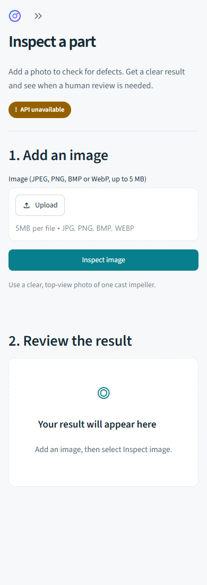
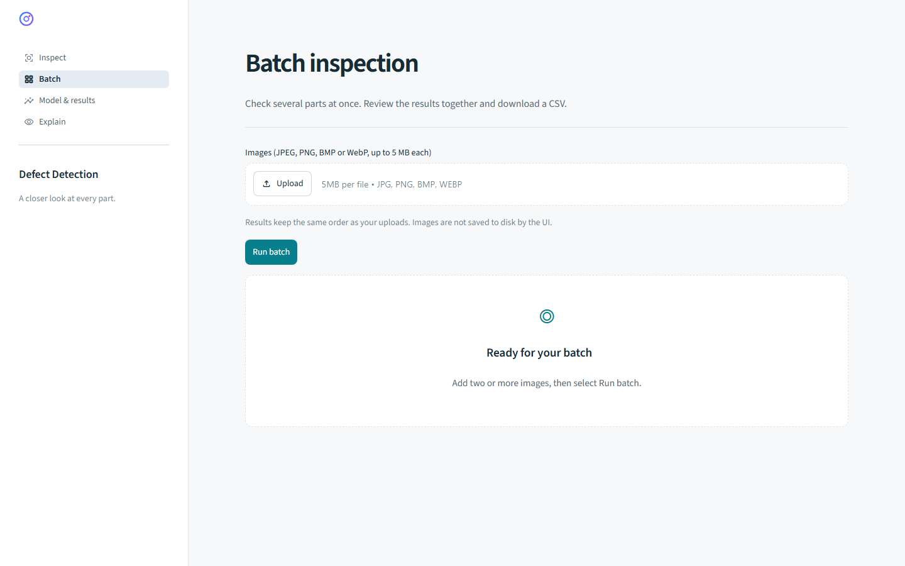
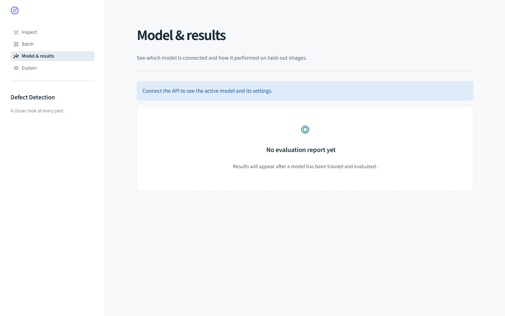
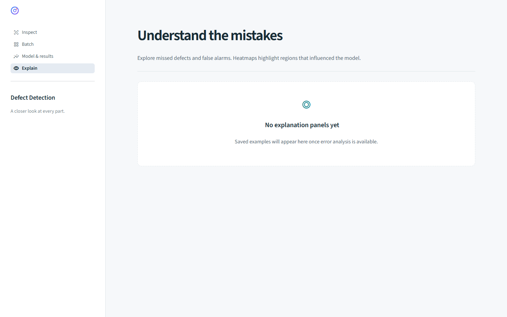
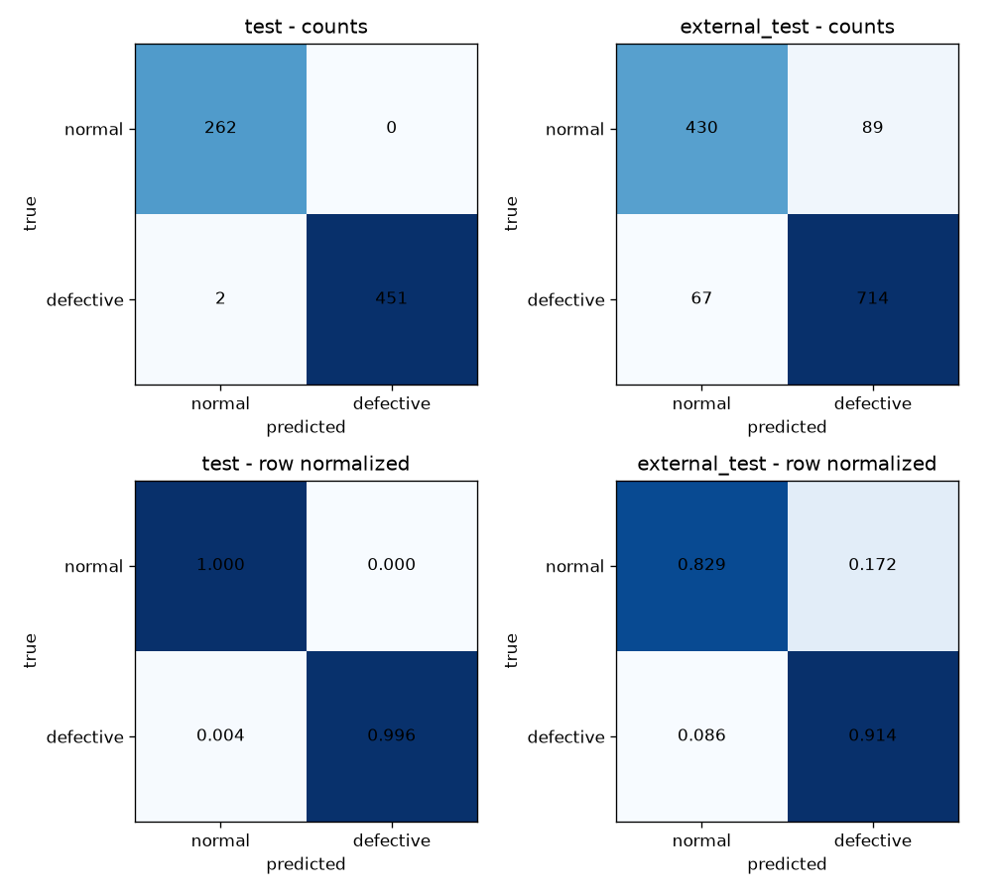
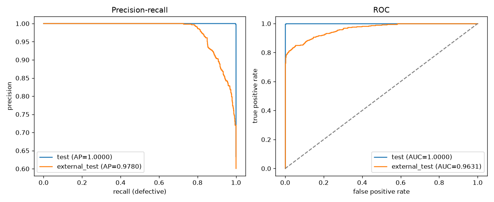
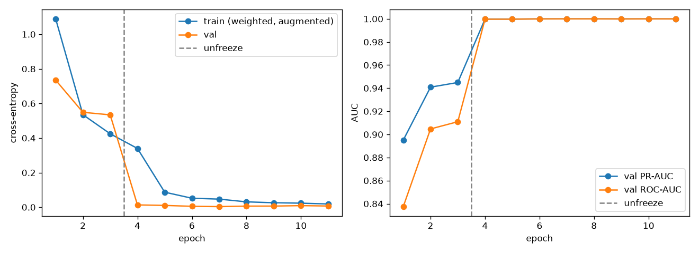
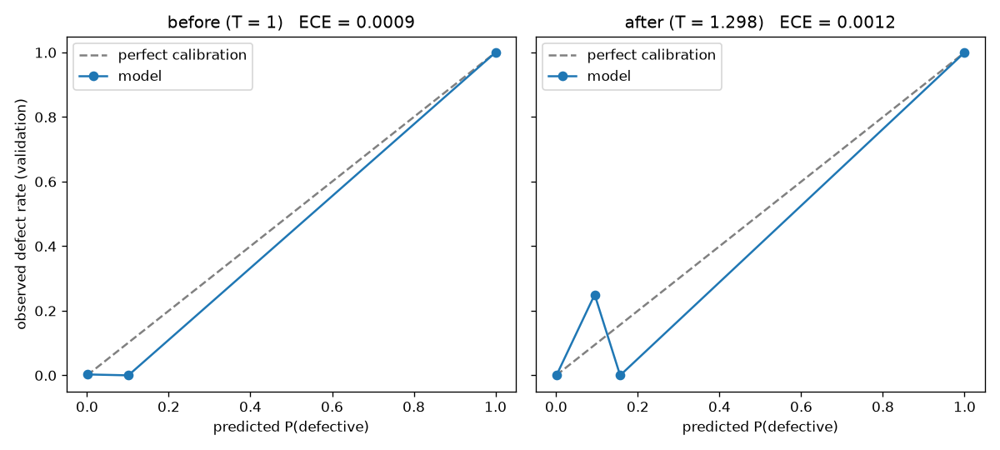
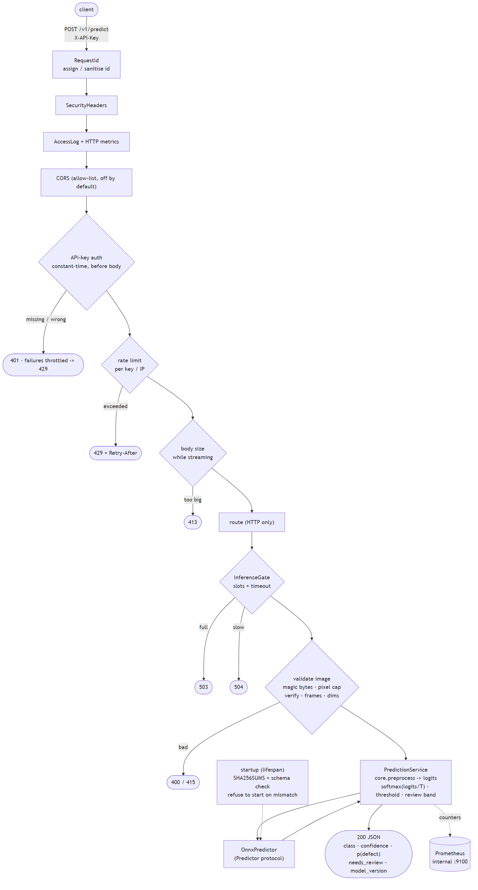
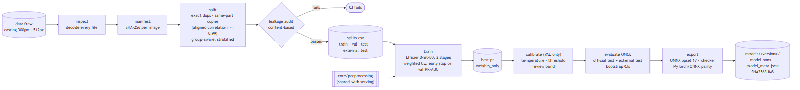

# Screenshots and results

A visual tour of Defect Detection. These are screenshots of the running Streamlit
app, not design mockups. The clean-start screens contain no uploaded photos,
API keys or private reports. Dataset photos and Grad-CAM panels stay local.

[Inspect](#inspect) · [Batch](#batch) · [Model & results](#model--results) ·
[Explain](#explain) · [Evaluation figures](#evaluation-figures)

## Inspect

Upload one image, inspect the predicted class and confidence, and check whether
human review is needed. Additional decision details expand below the result.

Inspect on mobile

## Batch

Upload multiple images and compare the results in one table. Download the
predictions as CSV for a local review.

## Model & results

View the connected model's settings and locally saved test metrics. Missing
reports have a clear empty state instead of an error.

## Explain

Choose a saved error example to compare the input with its Grad-CAM heatmap.
Heatmaps indicate model attention, not a precise defect boundary.

## Evaluation figures

These plots come from the completed evaluation, separately from the clean-start
UI screenshots above. See [evaluation.md](evaluation.md) for the full interpretation.

### Confusion matrices

The external capture produces substantially more errors than the official test.

### Precision–recall and ROC curves

Training and calibration figures

## Architecture

Training pipeline

Return to the [README](../README.md) or the [UI setup guide](../ui/README.md).
