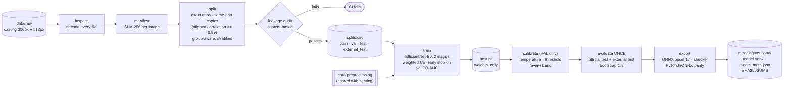
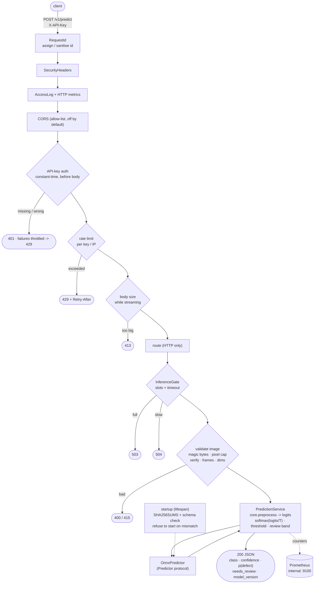

# Architecture

Two separate halves share one torch-free package, `core/` (class names, preprocessing, model
metadata, hashing):

- **Training** (offline, PyTorch): data audit → split → train → calibrate → evaluate once → export.
- **Serving** (online, ONNX Runtime): a FastAPI app that loads one verified, versioned model.

The only thing that crosses from training to serving is the immutable folder
`models/<version>/` (`model.onnx`, `model_meta.json`, `SHA256SUMS`).

## Training pipeline

## Serving request flow

## Layering rules (enforced, not just documented)

| Rule | Enforced by |
| --- | --- |
| `core/` and `serving/` never import torch/torchvision/timm | ruff `TID251` banned-api + `test_serving_never_imports_torch_or_training_stack` |
| Training and serving preprocess identically | `core/preprocessing.py` is the only implementation; `tests/leakage/test_preprocessing_parity.py` |
| Serving depends on the engine only through `Predictor` | `services/prediction.py` type-checks against the protocol (mypy strict) |
| Nothing is learned from test | calibration/threshold read `val` only (asserted in tests); `evaluate` refuses a second run |
| The model artifact is verified before use | `load_verified_meta` (checksums, schema, graph input) at startup |
