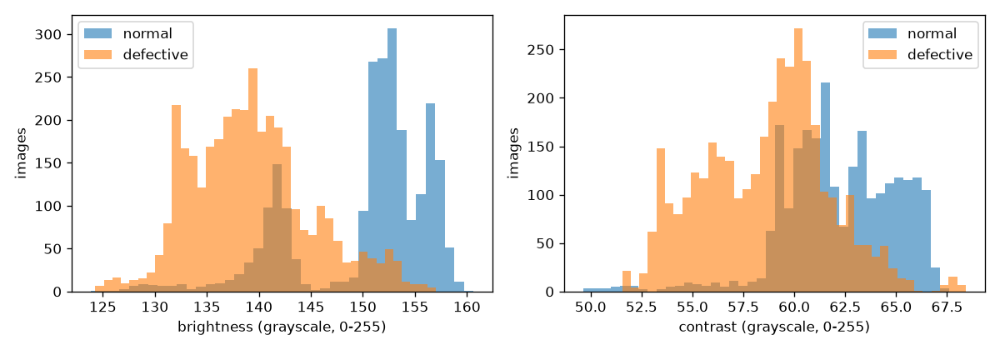

# Dataset, leakage controls and EDA

## Source

Kaggle *Real-life industrial dataset of casting product*: top-view photos of submersible-pump
impellers. Licence CC BY-NC-ND 4.0 (non-commercial; images are not redistributed in this repo).
Both releases in the archive are used (`reports/inventory.json`):

| Folder | Images | Size | Role |
| --- | --- | --- | --- |
| `casting_data/train/{def_front,ok_front}` | 3,758 / 2,875 | 300×300 | train + val |
| `casting_data/test/{def_front,ok_front}` | 453 / 262 | 300×300 | official test (kept intact) |
| `casting_512x512/{def_front,ok_front}` | 781 / 519 | 512×512 | external test |

All 8,648 files decode as RGB JPEG; none are corrupt.

## What we found

- **The official split leaks.** 64 test images are byte-identical to train images. Many more
  test images have a rotated, flipped or re-lit copy of the same physical part in train.
- **pHash cannot see it.** 64-bit pHash (Hamming ≤ 4) put 95% of images within 4 bits of
  another image, including different parts with different labels. Every photo shows the same
  part, centred, on the same background. pHash was rejected (D-031).
- **What works:** Pearson correlation of standardised grayscale images, maximised over the 8
  rotations/flips (32 px shortlist, 128 px re-score). Pairs at ≥ 0.99 were checked visually
  and were the same part (matching burrs and nicks) (D-032).

## Split (`data/processed/split_report.json`)

| Split | Normal | Defective | Defect rate | Median similarity to train |
| --- | --- | --- | --- | --- |
| train | 2,039 | 3,105 | 0.604 | — |
| val | 353 | 548 | 0.605 | 0.978 |
| test | 262 | 453 | 0.634 | 0.978 |
| external_test | 519 | 781 | 0.601 | 0.880 |

Excluded: 64 exact duplicates and 524 train images that are same-part copies (own similarity
≥ 0.99) of an official test image. Val is carved from train by same-part clusters
(union-find), stratified by label, seed 42.

## Leakage controls (all automated)

| Control | Where |
| --- | --- |
| SHA-256 manifest before any split | `data/manifest.py` |
| Exact + same-part dedupe, group-aware split | `data/dedupe.py`, `data/split.py` |
| Audit re-derives similarity from pixels (not cluster ids); fails on any overlap | `data/leakage_audit.py`, `tests/leakage/` |
| Test fingerprint recorded and re-checked before evaluation | `leakage_audit.json`, `training/one_shot_test.py` |
| EDA loads train/val only; calibration/threshold read val only | `data/eda.py`, tests assert it |

The audit passes. Cross-split pairs ≥ 0.99: **0** for val/train, test/train, test/val,
external/train and external/val.

## EDA findings (train + val only, `notebooks/01_eda.ipynb`)

1. Clean, uniform files: 6,045 images, all 300×300 RGB.
2. Moderate imbalance: 60.4% defective, the same in train and val.
3. **Lighting shortcut:** brightness alone separates the classes with AUC 0.883 (defective
   darker: 139 vs 150 grey levels); contrast alone gives 0.812. This is a capture artefact,
   not a defect property. Its effect on the model is measured in `evaluation.md`.
4. Augmented copies: 2,041 of 6,045 pool images sit in multi-image same-part clusters.
5. Label noise: 6 same-part clusters carry both labels (16 train images); kept, and flagged.

