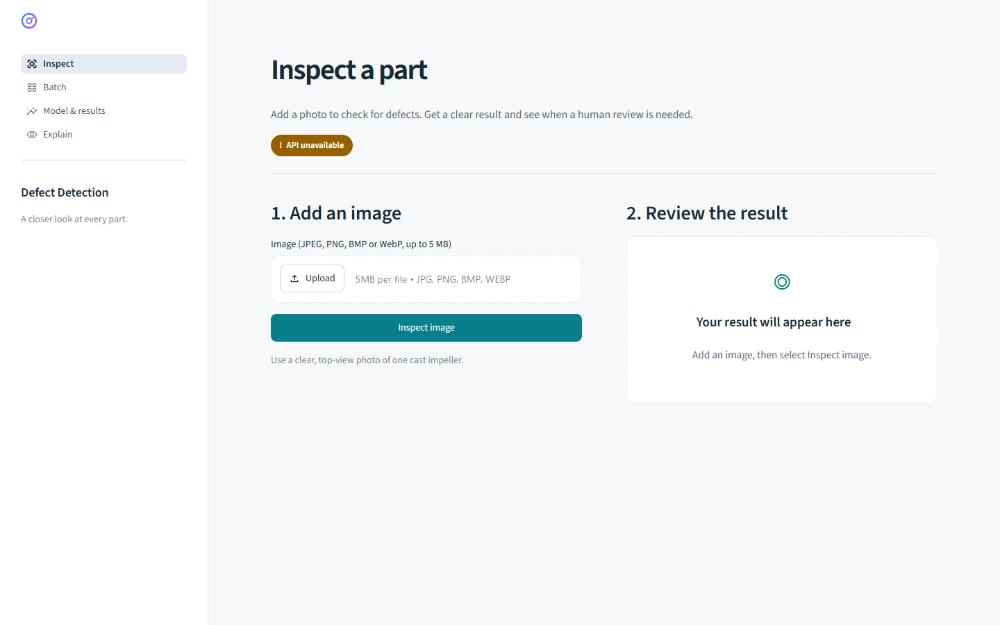

# Streamlit UI

Four pages, one API: **Inspect** checks an image, **Batch** compares multiple
images and exports CSV, **Model & results** shows evaluation metrics, and
**Explain** displays saved Grad-CAM examples.



Browse all screens in the [gallery](../docs/GALLERY.md).

## Run locally

From the repository root, install `bash scripts/setup.sh serve ui`, configure
`.env` using `.env.example`, and run `bash scripts/run_api.sh` and
`bash scripts/run_ui.sh` in separate terminals. Open <http://localhost:8501>.
The exported model must already exist; see the [main quickstart](../README.md#quickstart).

## UI demo

To watch the UI in action, view the [Streamlit UI walkthrough on Loom](https://www.loom.com/share/55d59f81004d40cfa33bc2156640cf9a).

## Configuration

| Setting | Default | Purpose |
| --- | --- | --- |
| `DD_UI_API_URL` | `http://127.0.0.1:8000` | API address |
| `DD_UI_API_KEY` | Empty | One of the API's configured keys; held server-side |
| `DD_UI_TIMEOUT_S` | `15` | Request timeout in seconds |
| `DD_UI_REPORTS_DIR` | `reports/` | Local evaluation reports and explanation panels |
| `DD_UI_SAMPLES_DIR` | `ui/assets/samples/` | Optional local sample images |
| `DD_UI_BATCH_CHUNK` | `16` | Images per API call; respect the API's limits |

`bash scripts/run_ui.sh --samples-from-data` copies optional examples from the
local dataset. Those photos stay ignored by Git. `uv run defect-detection explain`
generates explanation panels after training and evaluation; it needs the training dependencies.

## Docker

`docker compose up --build` starts both the API and UI. Set `DD_UI_API_KEY` in
`.env` to one of `DD_API_KEYS`. Compose uses `http://api:8000` internally.

The UI image contains code and dependencies only. To show locally generated
reports and samples, add an optional `compose.override.yaml` with read-only mounts:

```yaml
services:
  ui:
    volumes:
      - ./reports:/reports:ro
      - ./ui/assets/samples:/samples:ro
```

Only mount reports you intend to show to people who can access the UI. The API key
stays on the UI server; it does not authenticate browser users. Keep the UI on
localhost, or add authenticated access and TLS before exposing it.

## Interface

The default theme is light, with one teal accent and static status cards. Shared
styles live in `styles/`; the dark palette can be selected through Streamlit's
`theme.base` setting. Colors always have accompanying text, layouts wrap on small
screens, and technical decision details are collapsed on the Inspect page.

Uploads are held in the user's Streamlit session. The UI sends the original image
bytes to the API, does not preprocess model inputs, and does not write uploads to disk.
